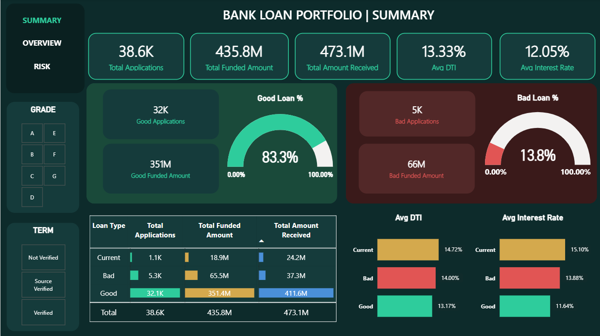
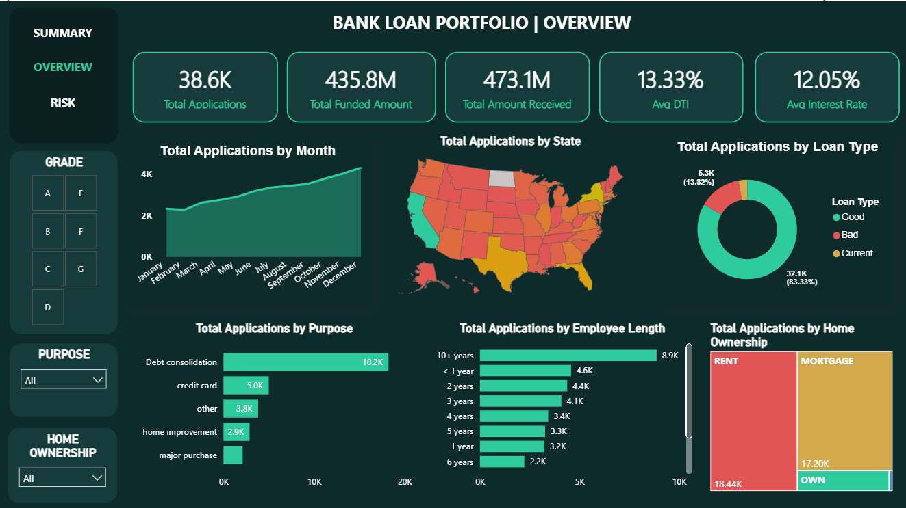
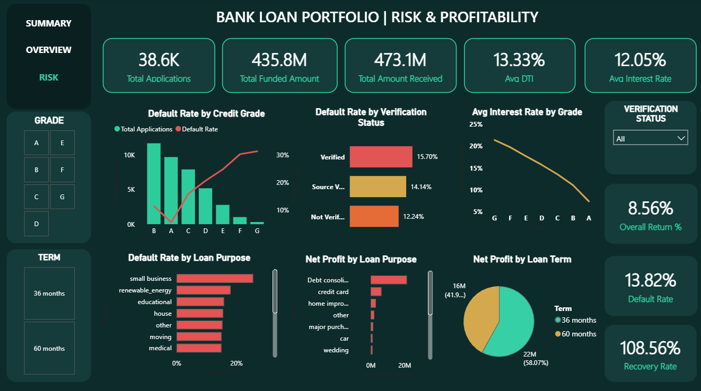

# Bank Loan Portfolio Analysis

A SQL and Power BI project analyzing 38,576 bank loan records — covering data
cleaning, portfolio KPIs, risk segmentation, borrower profiling, and
profitability.

## Overview

Starting from a raw CSV export, this project cleans the data in MySQL, then runs
it through a series of analytical queries to answer questions a bank's risk team
would actually ask: How big is the loan book? Where does default risk
concentrate? Are riskier loans priced correctly? Is the portfolio profitable
overall? The results are visualized in a 3-page Power BI dashboard and written
up in a full report.

## Dashboard Preview

**Summary**

**Overview**

**Risk & Profitability**

## Contents

| Folder | Contents |
|---|---|
| `data/` | Raw source file (`dataset_financial_loan.xlsx`) and the cleaned output (`cleaned_loan_data.csv`) |
| `sql/` | 8 numbered SQL scripts, from setup through profitability analysis |
| `dashboard/` | `BANK_LOAN.pbix` — interactive Power BI dashboard, plus page screenshots |
| `report/` | Full written analysis (`Bank_Loan_Analysis_Report.docx`) |

## SQL Scripts

1. `sql/1_database_setup.sql` — creates the schema and loads the raw CSV
2. `sql/2_data_cleaning.sql` — fixes date formats, handles missing values, derives
   `loan_type`, `emp_years`, and `issue_month`
3. `sql/3_kpi_analysis.sql` — portfolio-level KPIs
4. `sql/4_loan_status_breakdown.sql` — applications by state, grade, purpose, and more
5. `sql/5_risk_and_default_analysis.sql` — default rate by state, term, grade, and DTI
6. `sql/6_borrower_profile_analysis.sql` — DTI, employer, income, and verification patterns
7. `sql/7_grade_and_pricing_analysis.sql` — loan amount and interest rate by grade
8. `sql/8_repayment_and_profitability.sql` — profit/loss and overall portfolio return

## Data Notes

- `emp_length` (e.g. "10+ years") was converted to a numeric `emp_years` column —
  the raw text sorts alphabetically, which isn't useful for tenure analysis.
- 1,433 records (3.7%) are missing `emp_title` — kept as NULL rather than
  dropped, since income and loan amount are intact for those rows.
- `loan_type` (Good/Bad/Current) is derived from `loan_status` and used
  throughout the risk and profitability queries.

## Key Findings

- Default rate rises steadily with credit grade: **5.70%** at Grade A up to
  **31.31%** at Grade G — the grading system does what it's supposed to.
- **Verified loans default more often (15.70%) than unverified ones (12.24%).**
  The likely explanation: verification was probably triggered by red flags on
  the application, not applied at random — so "verified" doesn't mean "safe,"
  it means "got a closer look, and still defaulted more."
- Despite a 13.82% default rate, the portfolio returned **+8.56%** overall —
  interest from performing loans more than covered the losses.
- California accounts for 6,894 applications and $78.48M funded — more than the
  next two states combined.

## How to Run

1. Clone the repo
2. Point `sql/1_database_setup.sql` at your local copy of the CSV (update the
   `LOAD DATA INFILE` path)
3. Run the SQL scripts 1 through 8, in order, in MySQL Workbench
4. Open `dashboard/BANK_LOAN.pbix` in Power BI Desktop for the dashboard
5. Read `report/Bank_Loan_Analysis_Report.docx` for the full write-up

## Tools Used
MySQL / MySQL Workbench, Power BI Desktop, Microsoft Word

## Author
Tanishka Mathur — tanishkamathur28@gmail.com — [GitHub](https://github.com/tanishkamathur28-rgb)
